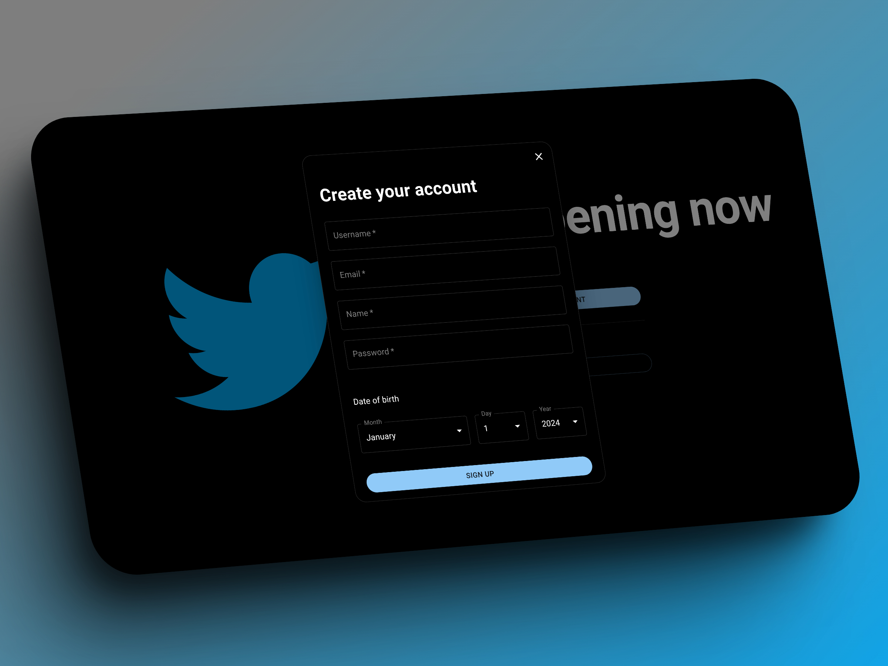

# Twitter Clone

This project is a simple clone of Twitter, created for the purpose of practicing and learning new technologies. It's a full-stack application with a backend built with NestJS and a frontend built with React.

## Why a Twitter Clone?

Building a Twitter clone provides a great opportunity to learn and practice various aspects of web development, from user authentication and real-time updates to handling and displaying user-generated content. It's a complex enough project to be challenging and educational, but not so complex as to be overwhelming.

## Technologies Used

- **Backend**: NestJS, a progressive Node.js framework for building efficient, reliable, and scalable server-side applications.
- **Frontend**: React, a JavaScript library for building user interfaces.
- **Database**: MongoDB, a source-available cross-platform document-oriented database program.
- **Styling**: Material-UI, a popular React UI framework that implements Google's Material Design.

## Some photos





## Getting Started

Try with this link: https://twitter-clone-frontend-ecru.vercel.app/

Or...

To get a local copy up and running, follow these steps:

1. Clone the repository:
    ```sh
    git clone https://github.com/santiagoasp98/twitter-clone.git
    ```

2. Install NPM packages:
    ```sh
    cd backend
    npm install
    cd ../client
    npm install
    ```

3. Modify the files backend/src/main.ts and client\src\api\axios.ts to establish the local connection.

4. Start the backend server:
    ```sh
    cd backend
    npm run start
    ```

5. Start the frontend server:
    ```sh
    cd client
    npm run dev
    ```

Now you should be able to access the application at `http://localhost:5173`.

## Contact

Santiago Silveira - santiago.asp.98@gmail.com

Project Link: [https://github.com/santiagoasp98/twitter-clone](https://github.com/santiagoasp98/twitter-clone)
